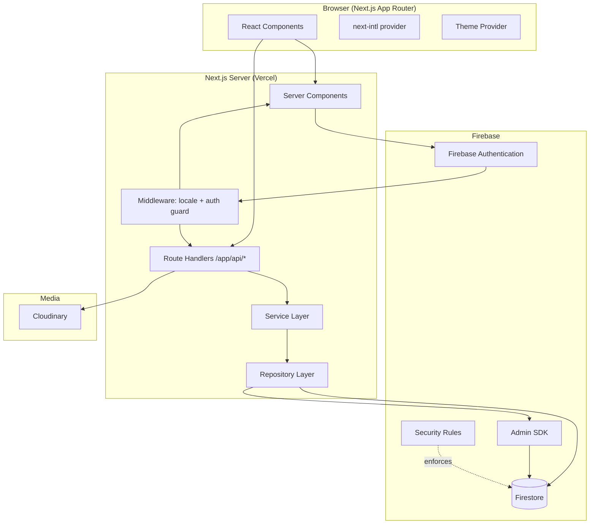
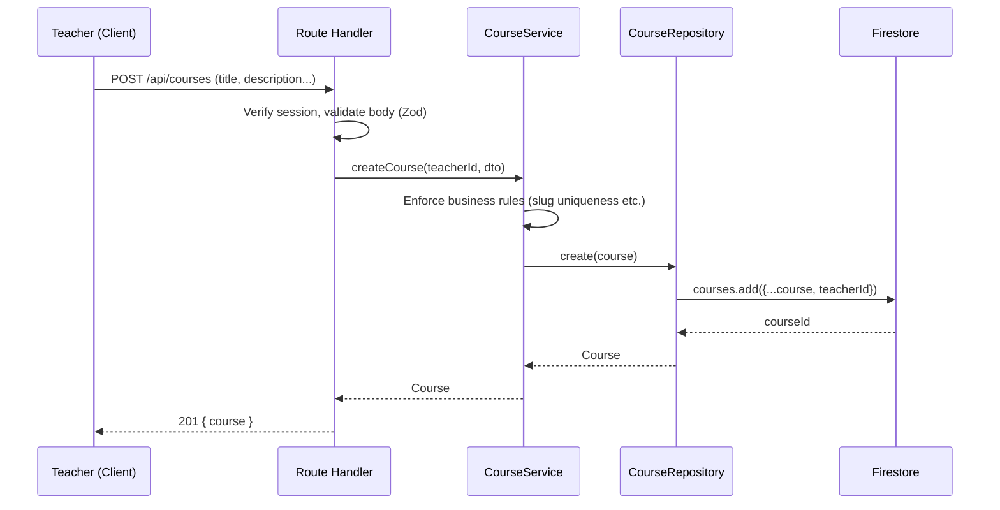

# Architecture Overview

## Guiding priority order

Security → Maintainability → Simplicity → Scalability → Accessibility → UX → Developer Experience

## High-level diagram



## Layering rules

Every server-side feature follows the same layered flow:

```
Route Handler / Server Action
        ↓
   Service (business logic, authorization checks)
        ↓
  Repository (Firestore/Cloudinary I/O only)
        ↓
     Firebase / Cloudinary
```

- **Route Handlers / Server Actions**: parse & validate input (Zod), call a
  service, map errors to translated, safe responses. No direct Firestore
  calls here.
- **Services**: business rules, ownership checks, orchestration
  across repositories. No Firestore SDK calls directly — always through a
  repository.
- **Repositories**: the *only* place allowed to call the Firestore/Admin
  SDK or Cloudinary SDK. One repository per collection (e.g.
  `courseRepository`, `lessonRepository`).

This mirrors the layered approach already used in the author's other
projects (repository → service → API route → page/component) and keeps
Firestore access centralized and auditable.

## Frontend architecture

- Next.js App Router, `app/[locale]/...` segment for i18n routing.
- Server Components by default; Client Components only where interactivity
  is required (forms, dialogs, canvas-like editors).
- Data fetching for authenticated pages happens in Server Components via
  services (using Admin SDK on the server) — no client-side Firestore SDK
  usage for owner-sensitive data.
- Client-side Firebase SDK is used only for: sign-in/sign-up forms, auth
  state listening, and reading explicitly public data if ever needed.

## Server-side architecture

- `lib/server/repositories/*` — Firestore Admin SDK access, one file per
  collection.
- `lib/server/services/*` — business logic per domain (courses, lessons,
  students, enrollments, quizzes, files, teachers).
- `app/api/**/route.ts` — thin HTTP layer calling services.
- `lib/validation/*` — Zod schemas shared between client forms and server
  validation.
- `lib/auth/*` — session verification, role guards usable in
  middleware, route handlers, and server components.

## Data flow (example: create course)



## Error handling

See `security/error-handling.md`. Summary: services throw typed
`AppError` subclasses (e.g. `NotFoundError`, `ForbiddenError`,
`ValidationError`); route handlers catch and map to `{ error: { code,
messageKey } }` responses; the client resolves `messageKey` via i18n.
Developer logs (server console) stay in English and never leak into the
client response.

## Validation

Zod schemas in `lib/validation/*` are the single source of truth for
shape validation, reused on both client (react-hook-form + zodResolver)
and server (route handlers re-validate — never trust client-only
validation).

## Internationalization & RTL/LTR

See `internationalization/README.md`. Locale is resolved from the URL
segment (`/en/...`, `/ar/...`), direction (`dir="rtl"|"ltr"`) is applied
at the root `<html>` tag, and all spacing/alignment use CSS logical
properties.

## Theme system

See `design-system/theming.md`. Theme is controlled via a `data-theme`
attribute on `<html>`, backed by CSS variables, with a client Theme
Provider persisting the choice (cookie, so the server can render the
correct theme on first paint — no flash).

## Deployment

See `deployment/vercel.md`. Fully serverless-compatible: no persistent
in-memory state, no local filesystem writes at runtime, Admin SDK
initialized per-invocation using env vars.
