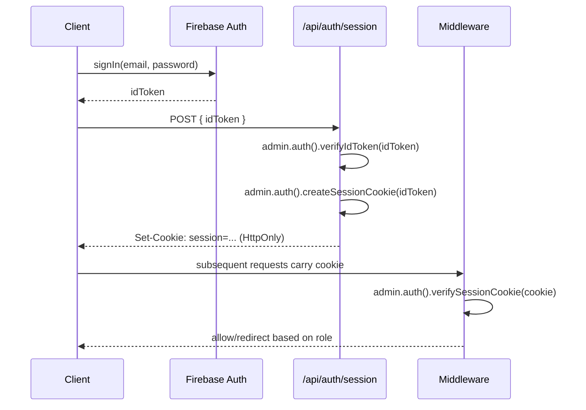

# Authentication Architecture

## Provider

Firebase Authentication, email/password for the MVP (extensible to OAuth
providers later without architecture changes).

## Flows

### No public self-registration

There is **no open sign-up page** and no `POST /api/auth/register` open
to unauthenticated clients. Every account is created by someone already
authenticated as Admin or Teacher — see "Account creation" below. This
is a deliberate change from the earlier single-teacher scope (which had
open teacher/student registration): the system is a private center, and
the Admin controls who gets an account.

### Account creation (Admin or Teacher, server-side)

1. An authenticated Admin (creating a teacher or student) or Teacher
   (creating a student only) submits the new user's profile
   (`email`, `displayName`, `role`, and for students `stageId`) to
   `POST /api/admin/accounts` (Admin) or `POST /api/teacher/students`
   (Teacher).
2. Server verifies the caller's session and role first (`assertRole`
   guard) — a Teacher calling with `role: "teacher"` or `role: "admin"`
   is rejected regardless of the request body.
3. Server creates the Firebase Auth user via the **Admin SDK**
   (`admin.auth().createUser(...)`) with a long random password nobody
   ever uses, then creates `users/{uid}` with `role`,
   `createdBy: { uid, role }`, and for teachers also
   `teacherProfiles/{uid}`. If the Firestore write fails, the Auth user
   is rolled back (`admin.auth().deleteUser(uid)`) so no orphaned
   Auth-only account is left behind.
4. Server generates a one-time password-reset link
   (`admin.auth().generatePasswordResetLink(email)`) and returns it in
   the response. The Admin/Teacher relays it to the new user directly
   (message, in person, etc.); the new user opens it, sets their own
   real password on `/[locale]/reset-password`, and logs in normally
   from then on — no separate "activate account" flow needed. See
   `decisions/0005-account-creation-credential-delivery.md` for why
   (no email provider is configured; this reuses the existing
   password-reset flow).

### Bootstrapping the first Admin (local/dev only)

Account creation always requires an already-authenticated Admin caller
(step 2 above), so the very first Admin account has no API path that
can create it. `scripts/seed-dev-accounts.ts`
(`npm run seed:dev-accounts`) is the one sanctioned exception: it talks
to the Admin SDK directly to create one Admin and one Teacher account
for local login, reusing `userRepository`/`teacherProfileRepository` so
the resulting documents are shaped exactly like a real
`accountService`-created account. It is a local script, not an HTTP
endpoint — there is no in-app "create the first Admin" flow, by design.

Implemented as `POST /api/admin/accounts` (Admin) and
`POST /api/teacher/students` (Teacher) — `lib/server/services/accountService.ts`.
A teacher optionally pre-enrolling a new student in one of their own
courses (`features/students.md`) is not part of this endpoint; per
`features/enrollment.md` an enrollment is only ever created as a side
effect of the payments flow, which doesn't exist yet (Phase 11).

### Login

1. Client signs in via Firebase Auth SDK, obtains an ID token.
2. Client calls `POST /api/auth/session` with the ID token.
3. Server verifies the token, creates a session cookie via
   `admin.auth().createSessionCookie(idToken, { expiresIn })`, sets it as
   an `HttpOnly`, `Secure`, `SameSite=Lax` cookie.

### Logout

`POST /api/auth/logout` clears the session cookie and calls
`admin.auth().revokeRefreshTokens(uid)` if immediate global sign-out is
required.

### Password reset

Uses Firebase Auth's built-in `sendPasswordResetEmail` client-side flow;
the email template and action URL are configured in the Firebase console
to point back at `/[locale]/reset-password`.

## Session strategy

We use **Firebase session cookies** (not raw ID tokens) so that:

- Server Components can read `getSession()` from the incoming cookie
  without a client round-trip.
- Sessions work correctly in the Vercel serverless environment (no
  in-memory server state).

## Protected routes

`proxy.ts` (the `middleware.ts` file convention is deprecated as of
Next.js 16 — same API, new name/export) runs on all
`app/[locale]/(protected)/**` routes:

1. Reads the session cookie.
2. Verifies it via Admin SDK (`verifySessionCookie`, checking revocation).
3. Attaches the resolved `{ uid, role }` to the request (via headers) for
   downstream Server Components/route handlers.
4. Redirects unauthenticated users to `/[locale]/login`.
5. Redirects authenticated users with the wrong role away from
   role-specific areas (e.g. a student hitting `/dashboard/teacher/*`).

## Login page

There is a **single, shared login page** (`/[locale]/login`) for Admin,
Teacher, and Student — no separate login URLs per role. After
authentication, the resolved `role` from `users/{uid}` decides which
dashboard the user is redirected to (`/admin`, `/teacher`, `/student`).

## Authentication state on the client

A thin `AuthProvider` (client component) wraps the app, listens to
`onAuthStateChanged` purely for UI reactivity (e.g. showing
login/logout button state), and is **not** used as the source of truth
for authorization — that is always the server-verified session.
