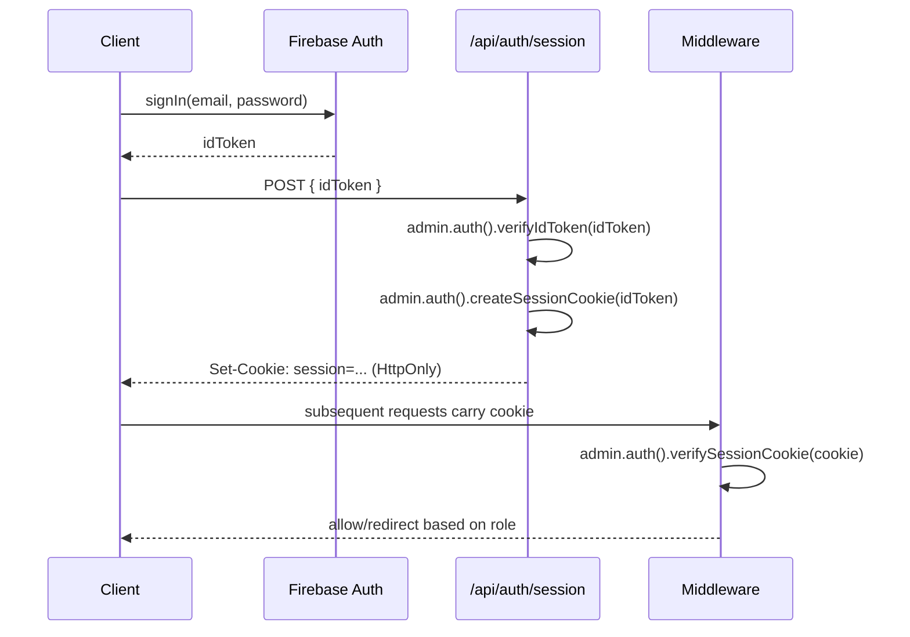

# Authentication Architecture

## Provider

Firebase Authentication, email/password for the MVP (extensible to OAuth
providers later without architecture changes).

## Flows

### Registration (teacher or student)

1. Client calls Firebase Auth `createUserWithEmailAndPassword`.
2. Client calls `POST /api/auth/register` with the new user's ID token and
   `role` (`teacher` | `student`) + profile fields.
3. Server verifies the ID token with the Admin SDK, creates `users/{uid}`
   (role is set **server-side only**, never trusted from the client body
   beyond the initial registration intent, and re-validated), and for
   teachers also creates `teacherProfiles/{uid}`.
4. Server issues a session (see "Session strategy" below).

### Login

1. Client signs in via Firebase Auth SDK, obtains an ID token.
2. Client calls `POST /api/auth/session` with the ID token.
3. Server verifies the token, creates a session cookie via
   `admin.auth().createSessionCookie(idToken, { expiresIn })`, sets it as
   an `HttpOnly`, `Secure`, `SameSite=Lax` cookie.

### Logout

`POST /api/auth/logout` clears the session cookie and calls
`admin.auth().revokeRefreshTokens(uid)` if immediate global sign-out is
required.

### Password reset

Uses Firebase Auth's built-in `sendPasswordResetEmail` client-side flow;
the email template and action URL are configured in the Firebase console
to point back at `/[locale]/reset-password`.

## Session strategy

We use **Firebase session cookies** (not raw ID tokens) so that:

- Server Components can read `getSession()` from the incoming cookie
  without a client round-trip.
- Sessions work correctly in the Vercel serverless environment (no
  in-memory server state).

## Protected routes

`proxy.ts` (the `middleware.ts` file convention is deprecated as of
Next.js 16 — same API, new name/export) runs on all
`app/[locale]/(protected)/**` routes:

1. Reads the session cookie.
2. Verifies it via Admin SDK (`verifySessionCookie`, checking revocation).
3. Attaches the resolved `{ uid, role }` to the request (via headers) for
   downstream Server Components/route handlers.
4. Redirects unauthenticated users to `/[locale]/login`.
5. Redirects authenticated users with the wrong role away from
   role-specific areas (e.g. a student hitting `/dashboard/teacher/*`).

## Authentication state on the client

A thin `AuthProvider` (client component) wraps the app, listens to
`onAuthStateChanged` purely for UI reactivity (e.g. showing
login/logout button state), and is **not** used as the source of truth
for authorization — that is always the server-verified session.
