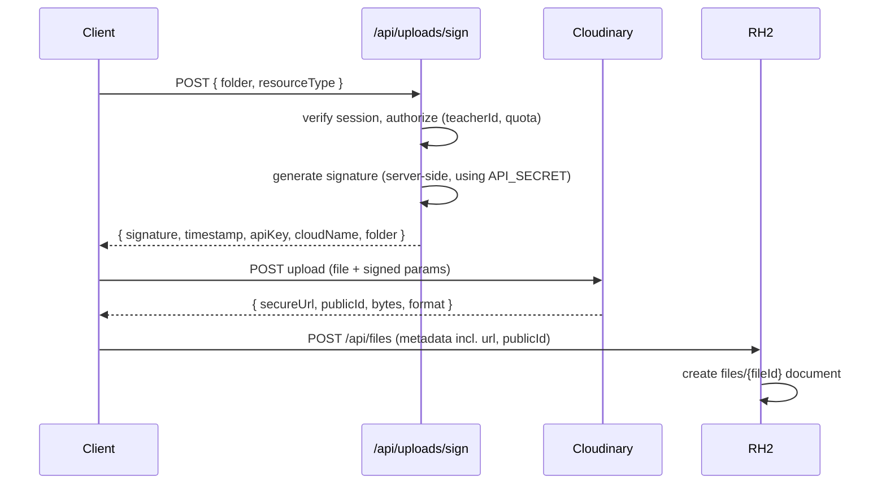

# Cloudinary Architecture

## Upload strategy: signed, server-authorized uploads

The client never holds `CLOUDINARY_API_SECRET`. Flow:



The signing route (`/api/uploads/sign`) is the enforcement point for
"can this teacher upload here" — it checks the session and the target
`teacherId`/`courseId` ownership before ever producing a signature.

## Folder structure

```text
{cloudName}/
  admins/{uid}/avatar/
  teachers/{teacherId}/avatar/
  teachers/{teacherId}/courses/{courseId}/thumbnail/
  teachers/{teacherId}/courses/{courseId}/lessons/{lessonId}/video/
  teachers/{teacherId}/courses/{courseId}/lessons/{lessonId}/files/
  students/{uid}/avatar/
```

Folder paths always begin with the owning `{role}s/{uid}` segment, which
keeps owner media naturally isolated and makes bulk cleanup (e.g. on
account deletion) a single folder-delete API call. `avatar` is the one
upload target open to every role (TASK-1005) — course/lesson targets
stay teacher-only.

## Image optimization

Delivery URLs use Cloudinary transformation parameters (`f_auto`,
`q_auto`, responsive `w_auto`/`dpr_auto`) generated by a small helper
(`lib/cloudinary/url.ts`) rather than hardcoded strings scattered across
components.

## Video handling

Lesson `video` field is provider-agnostic (see `database/collections.md`
→ `lessons`): `{ provider: "cloudinary" | "youtube" | "external", url,
publicId? }`. Cloudinary-hosted video uses Cloudinary's adaptive
streaming delivery URL; other providers just store an embeddable URL. A
single `<VideoPlayer provider={...} />` component switches rendering
strategy internally.

## Deletion strategy

When a course/lesson/file is deleted, the service layer calls a
`cloudinaryRepository.destroy(publicId, resourceType)` (via the Admin API
using the secret, server-side only) **before** removing the Firestore
document, and the operation is wrapped so a Cloudinary failure doesn't
leave an orphaned Firestore reference (retry/log strategy documented in
`security/error-handling.md`).

## Project

Cloud name: `dihm4riw5`. Credentials live only in local `.env.local` /
Vercel env vars — never in the repo (see TASK-104).

## Security

- `CLOUDINARY_API_SECRET` — server env var only, never sent to the
  client, never used in any `NEXT_PUBLIC_*` variable.
- `CLOUDINARY_CLOUD_NAME` and `CLOUDINARY_API_KEY` are not secret and may
  be exposed via `NEXT_PUBLIC_*` if the client SDK needs them for the
  signed-upload POST, but the actual signature is always server-computed.
- Upload presets, if used, are restricted (not "unsigned").
