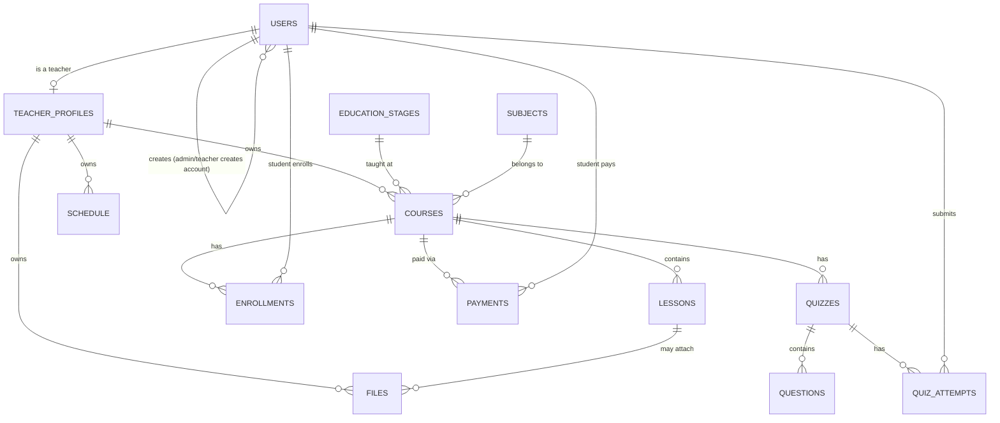

# Firestore Data Model

## Conventions

- Collection names: `camelCase`, plural (`courses`, `lessons`).
- Document IDs: Firestore auto-IDs, except `users/{uid}` which uses the
  Firebase Auth `uid`, and `teacherProfiles/{teacherId}` which also uses
  the auth `uid`.
- Timestamps: `createdAt`, `updatedAt` (Firestore `Timestamp`, set via
  `serverTimestamp()`), never client-supplied.
- Soft deletion: not used in the MVP — deletes are hard deletes performed
  through services (cascade rules documented per collection). Revisit if
  audit/history is required later.
- Slugs: lowercase, hyphenated, unique per teacher (`courseSlug`) or
  globally (`teacherSlug`), generated server-side.

## `users/{uid}`

Purpose: base identity + role record for every authenticated user
(teacher, student, admin).

| Field | Type | Required | Notes |
|---|---|---|---|
| uid | string | yes | = document id, = Firebase Auth uid |
| email | string | yes | |
| role | `"admin" \| "teacher" \| "student"` | yes | set once, server-side only, at account creation |
| createdBy | `{ uid: string, role: "admin" \| "teacher" }` | yes | who created this account — an Admin (any role) or a Teacher (student accounts only) |
| stageId | string | no (yes if role == "student") | ref to `educationStages`, the student's grade/level |
| displayName | string | yes | |
| phone | string | no | contact number (used for manual-payment matching) |
| avatarUrl | string | no | Cloudinary URL |
| birthDate | string | no | TASK-3201 — ISO `YYYY-MM-DD`, student self-service; display `age` is derived from this server-side at read time (`studentProfileService`), never stored |
| locale | `"en" \| "ar"` | no | preferred locale |
| createdAt | timestamp | yes | |
| updatedAt | timestamp | yes | |

Security: a user can read/update only their own document (except `role`
and `createdBy`, which are server-write-only and immutable after
creation). There is **no public registration** — `users` documents are
only ever created by an Admin (for any role) or a Teacher (student role
only), never by an unauthenticated client. See
`authentication/README.md`.

## `educationStages/{stageId}`

Purpose: fixed list of grade levels the center teaches, from nursery to
final year of secondary school.

| Field | Type | Required | Notes |
|---|---|---|---|
| order | number | yes | sort order, nursery = 0 |
| name | map `{ en, ar }` | yes | e.g. `{ en: "Grade 3 Secondary", ar: "3 ثانوي" }` |
| category | `"nursery" \| "primary" \| "prep" \| "secondary"` | yes | broad grouping used for filtering |

Seeded once by an Admin setup script; not user-created in the MVP UI.

## `subjects/{subjectId}`

Purpose: the list of subjects/specialties taught at the center (Physics,
Arabic, Math, ...). A teacher is linked to one or more subjects.

| Field | Type | Required | Notes |
|---|---|---|---|
| name | map `{ en, ar }` | yes | |
| createdAt | timestamp | yes | |

## `teacherProfiles/{teacherId}`

Purpose: public + private profile data for a teacher.

| Field | Type | Required | Notes |
|---|---|---|---|
| teacherId | string | yes | = uid |
| subjectIds | string[] | yes | refs into `subjects` |
| stageIds | string[] | yes | refs into `educationStages` this teacher teaches |
| slug | string | yes | unique, used in `/teachers/[slug]` |
| displayName | string | yes | |
| bio | map `{en?, ar?}` | no | TASK-3101 — migrated from a plain string; pre-migration docs still store a plain string and are read back as `{ en: <string> }` (see `teacherProfileRepository.normalizeBio`) |
| headline | map `{en?, ar?}` | no | TASK-3101 — short one-line tagline shown under the name on the directory card (TASK-2302); max 120 chars per locale |
| yearsOfExperience | number | no | TASK-3101 — integer, 0–80 |
| specialization | string | no | TASK-3101 — free text alongside the existing `subjectIds`, max 120 chars |
| socialLinks | map | no | TASK-3101 — optional keys `facebook`, `youtube`, `whatsapp`, `instagram`, `tiktok`, `website`, each a validated URL (`whatsapp` is a `wa.me` link, not a raw phone number — that's `users.phone`) |
| avatarUrl | string | no | Cloudinary URL |
| brandColor | string | no | future branding |
| isPublic | boolean | yes | default true |
| stats.totalStudents | number | yes | denormalized counter |
| stats.totalCourses | number | yes | denormalized counter |
| stats.totalPublishedCourses | number | yes | denormalized counter |
| stats.totalLessons | number | yes | denormalized counter |
| stats.totalEnrollments | number | yes | denormalized counter |
| createdAt / updatedAt | timestamp | yes | |

> Note (TASK-3101 scope): `lib/server/repositories/publicRepository.ts`'s
> separate `PublicTeacherProfile.bio` type (used by the `/teachers/[slug]`
> and landing pages) still reads `bio` as a plain string via `String(data.bio)`
> — for a profile whose `bio` has been migrated to the new map shape, that
> read now stringifies the object instead of showing text. Left unfixed
> here since those two files are outside this task's `Affected modules`;
> the actual student/public-facing rendering of the new fields is TASK-3102
> (edit form) / TASK-3203 (public profile page) — flagging here so it isn't
> quietly rediscovered later.

Relationships: 1:1 with `users/{teacherId}` where `role == "teacher"`.

## `courses/{courseId}`

| Field | Type | Required | Notes |
|---|---|---|---|
| teacherId | string | yes | data owner |
| subjectId | string | yes | ref into `subjects` |
| stageId | string | yes | ref into `educationStages` |
| slug | string | yes | unique per teacher |
| title | map `{ en, ar }` | yes | localized |
| description | map `{ en, ar }` | no | localized |
| thumbnailUrl | string | no | Cloudinary |
| status | `"draft" \| "published"` | yes | default draft |
| lessonOrder | string[] | yes | ordered array of lesson ids |
| enrollmentType | `"free" \| "paid"` | yes | default `paid` |
| price | number | no | required if `enrollmentType == "paid"` |
| currency | string | no | default `"EGP"` |
| createdAt / updatedAt | timestamp | yes | |

Indexes: `(teacherId, status)`, `(teacherId, createdAt desc)`,
`(stageId, subjectId, status)` (public course browsing by stage/subject).

## `schedule/{scheduleId}`

Purpose: a teacher's recurring weekly class slot for a subject/stage
(e.g. "Physics, Grade 3 Secondary — Tue & Thu, 5:00 PM").

| Field | Type | Required | Notes |
|---|---|---|---|
| teacherId | string | yes | owner — only this teacher (or Admin) may edit |
| subjectId | string | yes | |
| stageId | string | yes | |
| courseId | string | no | optional link, if the slot maps to a specific course |
| dayOfWeek | number | yes | `0`–`6` |
| startTime | string | yes | `"HH:mm"`, 24h |
| durationMinutes | number | yes | |
| meetingUrl | string | no | Google Meet / Zoom link for this slot's live session; set by the teacher around class time (Phase 6) |
| label | map `{ en, ar }` | no | free-text note, e.g. "Revision session" |
| lastNotifiedDate | string (`YYYY-MM-DD`) | no | Phase 20 (TASK-2002) dedupe marker — the calendar date the "class starting" auto-notification last fired for this recurring slot, so the per-minute cron doesn't resend it twice in one day |
| lastReminderDate | string (`YYYY-MM-DD`) | no | Phase 20 (TASK-2003) dedupe marker for the teacher's own pre-class reminder — tracked separately since it fires at a different offset from `startTime` |
| createdAt / updatedAt | timestamp | yes | |

Indexes: `(teacherId, dayOfWeek)`, `(stageId, subjectId, dayOfWeek)`
(students browsing/filtering the timetable by stage).

Authorization: only the owning teacher or Admin can create/edit/delete;
students and other teachers get read-only access.

## `lessons/{lessonId}`

| Field | Type | Required | Notes |
|---|---|---|---|
| teacherId | string | yes | denormalized for security rules |
| courseId | string | yes | |
| title | map `{ en, ar }` | yes | |
| description | map `{ en, ar }` | no | |
| order | number | yes | position within course |
| video | map `{ provider: "cloudinary"\|"youtube"\|"external", url, publicId? }` | no | extensible provider shape |
| fileIds | string[] | no | references into `files` |
| isFreePreview | boolean | yes | default `false` — TASK-3105; lets a non-enrolled student watch this lesson to evaluate the course before paying |
| createdAt / updatedAt | timestamp | yes | |

Indexes: `(courseId, order)`.

`isFreePreview` bypasses the enrollment gate in exactly two places: the
`firestore.rules` read rule on this collection (a signed-in student may
read a flagged lesson without an active `enrollments` doc), and
`lessonProgressService.reportProgress`'s `assertStudentEnrolled` check.
Teacher/Admin-settable only, via the normal lesson create/update flow —
no separate endpoint.

## `lessonProgress/{studentId_lessonId}`

Purpose: TASK-2501 (Phase 25) — fine-grained, per-lesson watch-time
tracking, a second signal alongside `enrollments.progress
.completedLessonIds` (the existing binary completed/not-completed
flag, which this collection does not replace). Folded into
`enrollment.progress.percent` by TASK-2503.

| Field | Type | Required | Notes |
|---|---|---|---|
| studentId | string | yes | |
| lessonId | string | yes | |
| watchedSeconds | number | yes | cumulative seconds watched, default `0` |
| videoDurationSeconds | number | yes | from the player, may be updated if it changes |
| lastPositionSeconds | number | yes | last reported playhead position, default `0` |
| updatedAt | timestamp | yes | |

Document id: `${studentId}_${lessonId}` (composite key, same pattern as
`enrollments/{studentId}_{courseId}`) — the common "my progress on this
lesson" lookup is a direct doc read, so no query index is needed for it.
No index is added yet for a teacher-side "all students' progress on this
lesson" query either; TASK-2504 (per-student progress view) adds one if
its access pattern needs it.

Authorization: a student may only read/write their own doc
(`studentId == request.auth.uid`); the owning teacher (via the lesson's
`teacherId`) and Admin may read but not write — this collection is a
student-reported signal, not something a teacher edits directly.

## `reviews/{teacherId_studentId}`

Purpose: TASK-2701 (Phase 27) — a student's rating + short review for a
teacher, shown on that teacher's public profile (TASK-2703). One review
per `(teacherId, studentId)` pair — editable, not stackable — which the
composite document id enforces the same way `enrollments`/
`lessonProgress` enforce their own uniqueness pairs.

| Field | Type | Required | Notes |
|---|---|---|---|
| teacherId | string | yes | |
| studentId | string | yes | |
| rating | number | yes | integer, 1–5 |
| comment | string | no | short free text |
| hidden | boolean | yes | default `false`; Admin moderation flag (TASK-2704), never client-settable at create |
| createdAt | timestamp | yes | |
| updatedAt | timestamp | yes | |

Document id: `${teacherId}_${studentId}` (composite key, same pattern as
`enrollments/{studentId}_{courseId}`) — both "does this student already
have a review for this teacher" and "upsert on edit" are direct doc
reads/writes, so no query index is needed for those. The public
"teacher's reviews, newest first" list (TASK-2703) queries by
`teacherId` with `hidden == false`; see Indexes below.

Indexes: `(teacherId, hidden, createdAt desc)` — the public reviews list.

Authorization: eligibility (the student must have, or have had, an
enrollment with this teacher — TASK-1101) is enforced server-side by the
Admin SDK at submit time (TASK-2702), not by these rules, since it
requires a cross-collection check the security-rules layer can't express
cheaply here. A student may create/edit only their own review and can
never set `hidden`; only the Admin may flip `hidden` (TASK-2704), and
only Admin/the reviewed teacher can read a hidden review — the public
read excludes it. No client delete (a student who wants to retract a
review edits it instead; full deletion, if ever needed, stays an
Admin-SDK operation outside this rule set).

## `enrollments/{enrollmentId}`

| Field | Type | Required | Notes |
|---|---|---|---|
| studentId | string | yes | |
| courseId | string | yes | |
| teacherId | string | yes | denormalized owner |
| status | `"active" \| "completed" \| "cancelled"` | yes | |
| enrollmentDate | timestamp | yes | |
| progress.completedLessonIds | string[] | yes | default `[]` |
| progress.percent | number | yes | derived, recalculated server-side |

Indexes: `(studentId, courseId)` unique pair, `(teacherId, courseId)`,
`(studentId, status)`.

An enrollment is only created once its linked `payments` document (see
below) is `succeeded` (online) or `confirmed` (manual) — never on an
unpaid/pending payment.

## `payments/{paymentId}`

Purpose: record of a student's payment for a paid course, online or
manual, and the state machine that gates enrollment.

| Field | Type | Required | Notes |
|---|---|---|---|
| studentId | string | yes | |
| courseId | string | yes | |
| teacherId | string | yes | denormalized owner, for teacher-scoped queries |
| amount | number | yes | |
| currency | string | yes | default `"EGP"` |
| method | `"card" \| "fawry" \| "vodafone_cash" \| "bank_transfer"` | yes | `card`/`fawry` = online gateway; `vodafone_cash`/`bank_transfer` = manual |
| status | `"pending" \| "succeeded" \| "confirmed" \| "rejected"` | yes | `pending` → awaiting gateway callback (online) or review (manual); `succeeded` = online gateway confirmed; `confirmed` = Admin/Teacher manually verified a manual payment; `rejected` = manual payment reviewed and declined |
| referenceNote | string | no | student-entered transfer reference (manual methods) |
| confirmedBy | `{ uid, role }` | no | set when a manual payment is confirmed/rejected |
| gatewayTransactionId | string | no | set for online methods |
| createdAt / updatedAt | timestamp | yes | |

Indexes: `(teacherId, status)` (teacher's pending manual payments to
review), `(studentId, status)`.

Authorization: a student can create a `pending` payment for themself and
read their own payment history. Only the owning teacher or Admin can set
`status` to `confirmed`/`rejected` (manual methods); `succeeded` is set
only by the server-side gateway webhook handler, never by client input.

## `teacherOfferings/{offeringId}`

> Documented during the TASK-1802 audit — implemented (repository,
> service, validation, `admin/offerings` + `admin/teachers/[teacherId]
> /offerings` API routes) but had no entry here and no task file. See
> the TASK-1802 note in `tasks/phase-18-mvp-finalization.md` for the
> full gap. `tasks/phase-29-teacher-subscriptions.md` now tracks this
> feature; TASK-2907 added `firestore.rules` coverage for this
> collection (and `subscriptions`/`subscriptionInvoices` below) — what's
> still outstanding is UI (TASK-2908/2909), everything here is
> backend-only so far, no page mounts it yet.

Purpose: Admin-set monthly price for one of a teacher's subjects at one
grade level (e.g. "Physics, Grade 3 Secondary" → a price). One offering
per `(teacherId, subjectId, stageId)` triple, enforced at the service
layer. Feeds `subscriptions` below — separate from `teacherProfiles
.subjectIds` (TASK-2402), which is about which subjects a teacher may
create *courses* under, not pricing.

| Field | Type | Required | Notes |
|---|---|---|---|
| teacherId | string | yes | |
| subjectId | string | yes | ref into `subjects` |
| stageId | string | yes | ref into `educationStages` |
| monthlyPrice | number | yes | whole EGP, no decimals |
| createdAt / updatedAt | timestamp | yes | |

## `subscriptions/{subscriptionId}`

> Documented during the TASK-1802 audit — see the `teacherOfferings`
> note above; same gap, same task.

Purpose: a student's standing monthly subscription to one teacher for
one priced `teacherOfferings` offering. Deliberately separate from
`enrollments`: an enrollment ties a student to one specific `course`'s
lessons (gated by a `payments` doc); a subscription is the
higher-level "this student studies with this teacher, this subject,
this grade" relationship the Admin sets up directly, and is what the
Phase 6 meeting-link broadcast and student-facing schedule/course
views should scope to.

| Field | Type | Required | Notes |
|---|---|---|---|
| studentId | string | yes | |
| teacherId | string | yes | |
| offeringId | string | yes | ref into `teacherOfferings` |
| subjectId | string | yes | denormalized from the offering |
| stageId | string | yes | denormalized from the offering |
| status | `"active" \| "cancelled"` | yes | |
| createdAt | timestamp | yes | |

## `subscriptionInvoices/{invoiceId}`

> Documented during the TASK-1802 audit — see the `teacherOfferings`
> note above; same gap, same task.

Purpose: one month's bill for one `subscriptions` doc. Mirrors
`payments`' manual-review state machine (`pending → confirmed
/ rejected`) so the Admin/teacher payments UI can reuse the same
patterns, but stays a separate collection since an invoice isn't tied
to a `course`. One invoice per `(subscriptionId, period)`, enforced at
the service layer.

| Field | Type | Required | Notes |
|---|---|---|---|
| subscriptionId | string | yes | |
| studentId | string | yes | denormalized |
| teacherId | string | yes | denormalized |
| offeringId | string | yes | denormalized |
| period | string | yes | `YYYY-MM` |
| amount | number | yes | |
| currency | string | yes | |
| status | `"pending" \| "confirmed" \| "rejected"` | yes | |
| method | `"cash" \| "vodafone_cash" \| "bank_transfer"` | no | set on manual review |
| referenceNote | string | no | |
| confirmedBy | `{ uid, role }` | no | |
| createdAt / updatedAt | timestamp | yes | |

## `quizzes/{quizId}`

| Field | Type | Required | Notes |
|---|---|---|---|
| teacherId | string | yes | |
| courseId | string | no (TASK-2101) | absent means a standalone, stage-wide exam — `stageId`/`scheduledAt` are required instead |
| lessonId | string | no | optional link to a lesson |
| title | map `{ en, ar }` | yes | |
| status | `"draft" \| "published"` | yes | |
| questionIds | string[] | yes | ordered |
| stageId | string | required iff `courseId` absent (TASK-2101) | ref into `educationStages` — the stage this standalone exam targets |
| scheduledAt | timestamp | required iff `courseId` absent (TASK-2101) | when the exam opens for students |
| autoGrade | boolean | yes (TASK-2102) | defaults to `true`; `false` means attempts need manual teacher grading |
| createdAt / updatedAt | timestamp | yes | |

## `questions/{questionId}`

| Field | Type | Required | Notes |
|---|---|---|---|
| teacherId | string | yes | |
| quizId | string | yes | |
| type | `"multiple_choice" \| "true_false"` | yes | MVP types; extensible enum |
| prompt | map `{ en, ar }` | yes | |
| options | array `{ id, text: {en, ar} }` | yes (for choice types) | |
| correctOptionIds | string[] | yes | not exposed to students via API |

## `quizAttempts/{attemptId}`

| Field | Type | Required | Notes |
|---|---|---|---|
| studentId | string | yes | |
| quizId | string | yes | |
| teacherId | string | yes | |
| answers | array `{ questionId, selectedOptionIds }` | yes | |
| score | number | yes | computed server-side, never client-submitted; `0` placeholder while `status === "pending_review"` |
| status | `"graded" \| "pending_review"` | yes (TASK-2102) | `pending_review` for manually-graded (`quiz.autoGrade === false`) attempts until a teacher scores them |
| gradedBy | string | no (TASK-2102) | teacher/Admin uid who graded a `pending_review` attempt |
| gradedAt | timestamp | no (TASK-2102) | |
| submittedAt | timestamp | yes | |

## `files/{fileId}`

| Field | Type | Required | Notes |
|---|---|---|---|
| teacherId | string | yes | owner |
| courseId | string | no | |
| lessonId | string | no | |
| fileName | string | yes | |
| fileType | string | yes | MIME type |
| fileSize | number | yes | bytes |
| url | string | yes | Cloudinary secure URL |
| publicId | string | yes | Cloudinary public id (for deletion) |
| createdAt | timestamp | yes | |

## `notifications/{notificationId}`

Purpose: fan-out of a schedule slot's meeting link to the matching
students (Phase 6, TASK-1602) — one doc per recipient, so each student's
read state is independent. Extended in Phase 20 (TASK-2002, TASK-2003)
to also cover automated "class starting" pushes and a teacher's own
pre-class reminder, addressed via the same collection.

| Field | Type | Required | Notes |
|---|---|---|---|
| recipientId | string | yes | who this notification is *for* — a student for `type: "meeting_link"`, the teacher themselves for `type: "class_reminder"`, any role for `type: "audit"`. Renamed from `studentId` in Phase 20 to cover both. |
| teacherId | string | `meeting_link`/`class_reminder` only | sender/owning teacher, denormalized |
| type | `"meeting_link" \| "class_reminder" \| "audit"` | yes | `class_reminder` added Phase 20 (TASK-2003); `audit` added Phase 30 (TASK-3003) |
| scheduleId | string | `meeting_link`/`class_reminder` only | ref into `schedule` |
| subjectId | string | `meeting_link`/`class_reminder` only | denormalized from the schedule slot |
| stageId | string | `meeting_link`/`class_reminder` only | denormalized from the schedule slot |
| meetingUrl | string | `meeting_link` only | copied from `schedule.meetingUrl` at send time; absent on a `class_reminder` sent before the teacher has set one |
| link | string | no | TASK-3002 — relative in-app path (no locale prefix) to navigate to on click: `/student/teachers/{teacherId}` for `meeting_link` (no direct `courseId` on a schedule slot, so this is the closest "course page"), `/teacher/dashboard` for `class_reminder` (where the schedule lives), per-entity for `audit` (e.g. `/teacher/courses/{courseId}`) — absent entirely when no sensible target exists (e.g. payment notifications, since there is no dedicated payments page for either role today), in which case the UI degrades to mark-as-read-only. Absent on notifications written before TASK-3002 shipped. |
| action | `"created" \| "updated" \| "deleted"` | `audit` only | TASK-3003 |
| entityType | string | `audit` only | TASK-3003 — e.g. `"course"`, `"lesson"`, `"enrollment"`, `"payment"` |
| entityId | string | `audit` only | TASK-3003 — id of the affected document |
| title | `{ en: string; ar: string }` | `audit` only | TASK-3003 — server-generated localized copy, rendered directly by `AuditNotificationsPanel` (not a `next-intl` key, since the entity/action space is open-ended) |
| acknowledged | boolean | `class_reminder` only | TASK-3005 — a teacher's "noted" dismiss action, independent of `read`. Absent (falsy) on every other type and on `class_reminder` docs written before this task shipped. |
| read | boolean | yes | default `false`, flips to `true` client-side |
| createdAt | timestamp | yes | |

Indexes: `(recipientId, createdAt desc)`, plus `(recipientId, type, createdAt desc)` composite reads used by each of `listByStudent`/`listByTeacherRecipient`/`listByRecipientAudit`.

Authorization: server-created only (`notificationService.sendMeetingLink`
for manual sends, `classNotificationsJob` for the Phase 20 automated
ones, `auditNotificationService.notify` for Phase 30's generic trail —
all via the Admin SDK) — never client-created. A user may read
and mark read only their own (`recipientId == auth.uid`) notifications;
an Admin may read any.

Recipient rule (item 18 of Phase 6, unchanged by Phase 20's automation —
`classNotificationsJob` applies the same check): a schedule slot's
meeting link is sent to every student who (a) has an *active* enrollment
with the slot's owning teacher (any course), and (b) has `users.stageId`
exactly equal to the slot's `stageId` — not merely "one of this
teacher's students".

`audit` recipients (TASK-3003): decided per call site by
`auditNotificationService.notify`'s caller — the acting user's own
confirmation and, where relevant, the owning teacher/student on the
other side of the mutation (see `lib/server/services/auditNotificationService.ts`
and each wired service's own call site for the exact recipient list per
entity type).

## `users/{uid}/fcmTokens/{tokenId}`

Purpose: registered push-notification device tokens for FCM (Phase 26,
TASK-2602) — one doc per device/browser, so a user with several signed-in
devices gets pushes on all of them. `tokenId` is a deterministic
`sha256(token)` hash (not a raw token, for Firestore doc-id length/char
constraints) — re-registering the same token on the same device upserts
in place instead of accumulating duplicates.

| Field | Type | Required | Notes |
|---|---|---|---|
| token | string | yes | the FCM registration token itself |
| userAgent | string | no | best-effort device/browser label, client-reported |
| createdAt | number (epoch ms) | yes | set once, preserved across re-registration |
| updatedAt | number (epoch ms) | yes | bumped on every re-registration — doubles as "last seen" |

Authorization: server-created/read/deleted only, via
`fcmTokenService`/`/api/notifications/fcm-tokens` (Admin SDK) — a user
manages only their own tokens (any role: student, teacher, or admin).
Security Rules mirror this as a safety net (owner-only, same pattern as
every other collection).

Cleanup: expired/invalid tokens (FCM `messaging/registration-token-not-registered`
and similar) are pruned by the server-side dispatch step (TASK-2603, Done —
`pushDispatchService`) when a `send` call reports one as dead — not by a
scheduled job.

## `systemStats/global`

> Documented during the TASK-1802 audit — implemented since TASK-1902
> (Phase 19, `Done`) but never added here; not part of the
> subscriptions/offerings gap above, just a separate one-doc oversight.

Purpose: single denormalized doc backing the Admin dashboard's
center-wide overview cards, updated incrementally by the feature
services as events happen (same pattern as `teacherProfiles.stats`)
rather than live collection scans.

| Field | Type | Required | Notes |
|---|---|---|---|
| totalTeachers | number | yes | |
| totalStudents | number | yes | |
| totalCourses | number | yes | |
| totalPublishedCourses | number | yes | |
| totalEnrollments | number | yes | |
| totalPublishedLessons | number | yes | "published" = exists under a course; lessons have no separate draft state |

## Relationship diagram

