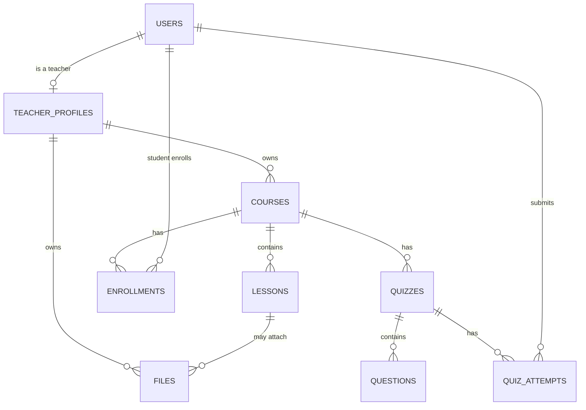

# Firestore Data Model

## Conventions

- Collection names: `camelCase`, plural (`courses`, `lessons`).
- Document IDs: Firestore auto-IDs, except `users/{uid}` which uses the
  Firebase Auth `uid`, and `teacherProfiles/{teacherId}` which also uses
  the auth `uid`.
- Timestamps: `createdAt`, `updatedAt` (Firestore `Timestamp`, set via
  `serverTimestamp()`), never client-supplied.
- Soft deletion: not used in the MVP — deletes are hard deletes performed
  through services (cascade rules documented per collection). Revisit if
  audit/history is required later.
- Slugs: lowercase, hyphenated, unique per teacher (`courseSlug`) or
  globally (`teacherSlug`), generated server-side.

## `users/{uid}`

Purpose: base identity + role record for every authenticated user
(teacher, student, admin).

| Field | Type | Required | Notes |
|---|---|---|---|
| uid | string | yes | = document id, = Firebase Auth uid |
| email | string | yes | |
| role | `"admin" \| "teacher" \| "student"` | yes | set at registration, immutable by client |
| displayName | string | yes | |
| avatarUrl | string | no | Cloudinary URL |
| locale | `"en" \| "ar"` | no | preferred locale |
| createdAt | timestamp | yes | |
| updatedAt | timestamp | yes | |

Security: a user can read/update only their own document (except `role`,
which is server-write-only).

## `teacherProfiles/{teacherId}`

Purpose: public + private profile data for a teacher (the tenant record).

| Field | Type | Required | Notes |
|---|---|---|---|
| teacherId | string | yes | = uid |
| slug | string | yes | unique, used in `/teachers/[slug]` |
| displayName | string | yes | |
| bio | string | no | |
| avatarUrl | string | no | |
| brandColor | string | no | future branding |
| isPublic | boolean | yes | default true |
| stats.totalStudents | number | yes | denormalized counter |
| stats.totalCourses | number | yes | denormalized counter |
| createdAt / updatedAt | timestamp | yes | |

Relationships: 1:1 with `users/{teacherId}` where `role == "teacher"`.

## `courses/{courseId}`

| Field | Type | Required | Notes |
|---|---|---|---|
| teacherId | string | yes | tenant owner |
| slug | string | yes | unique per teacher |
| title | map `{ en, ar }` | yes | localized |
| description | map `{ en, ar }` | no | localized |
| thumbnailUrl | string | no | Cloudinary |
| category | string | no | |
| status | `"draft" \| "published"` | yes | default draft |
| lessonOrder | string[] | yes | ordered array of lesson ids |
| enrollmentType | `"free" \| "paid" \| "subscription"` | yes | default `free` in MVP |
| price | number | no | reserved for future payments |
| createdAt / updatedAt | timestamp | yes | |

Indexes: `(teacherId, status)`, `(teacherId, createdAt desc)`.

## `lessons/{lessonId}`

| Field | Type | Required | Notes |
|---|---|---|---|
| teacherId | string | yes | denormalized for security rules |
| courseId | string | yes | |
| title | map `{ en, ar }` | yes | |
| description | map `{ en, ar }` | no | |
| order | number | yes | position within course |
| video | map `{ provider: "cloudinary"\|"youtube"\|"external", url, publicId? }` | no | extensible provider shape |
| fileIds | string[] | no | references into `files` |
| createdAt / updatedAt | timestamp | yes | |

Indexes: `(courseId, order)`.

## `enrollments/{enrollmentId}`

| Field | Type | Required | Notes |
|---|---|---|---|
| studentId | string | yes | |
| courseId | string | yes | |
| teacherId | string | yes | denormalized owner |
| status | `"active" \| "completed" \| "cancelled"` | yes | |
| enrollmentDate | timestamp | yes | |
| progress.completedLessonIds | string[] | yes | default `[]` |
| progress.percent | number | yes | derived, recalculated server-side |

Indexes: `(studentId, courseId)` unique pair, `(teacherId, courseId)`,
`(studentId, status)`.

## `quizzes/{quizId}`

| Field | Type | Required | Notes |
|---|---|---|---|
| teacherId | string | yes | |
| courseId | string | yes | |
| lessonId | string | no | optional link to a lesson |
| title | map `{ en, ar }` | yes | |
| status | `"draft" \| "published"` | yes | |
| questionIds | string[] | yes | ordered |
| createdAt / updatedAt | timestamp | yes | |

## `questions/{questionId}`

| Field | Type | Required | Notes |
|---|---|---|---|
| teacherId | string | yes | |
| quizId | string | yes | |
| type | `"multiple_choice" \| "true_false"` | yes | MVP types; extensible enum |
| prompt | map `{ en, ar }` | yes | |
| options | array `{ id, text: {en, ar} }` | yes (for choice types) | |
| correctOptionIds | string[] | yes | not exposed to students via API |

## `quizAttempts/{attemptId}`

| Field | Type | Required | Notes |
|---|---|---|---|
| studentId | string | yes | |
| quizId | string | yes | |
| teacherId | string | yes | |
| answers | array `{ questionId, selectedOptionIds }` | yes | |
| score | number | yes | computed server-side, never client-submitted |
| submittedAt | timestamp | yes | |

## `files/{fileId}`

| Field | Type | Required | Notes |
|---|---|---|---|
| teacherId | string | yes | owner |
| courseId | string | no | |
| lessonId | string | no | |
| fileName | string | yes | |
| fileType | string | yes | MIME type |
| fileSize | number | yes | bytes |
| url | string | yes | Cloudinary secure URL |
| publicId | string | yes | Cloudinary public id (for deletion) |
| createdAt | timestamp | yes | |

## Relationship diagram

