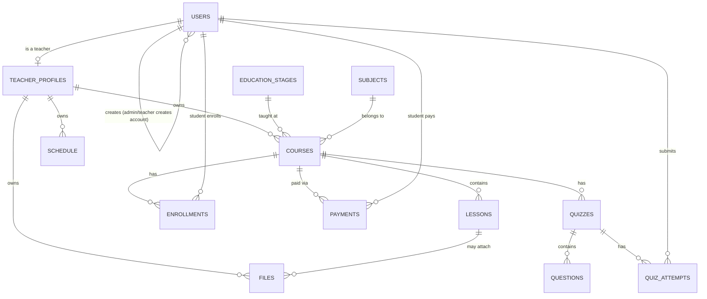

# Firestore Data Model

## Conventions

- Collection names: `camelCase`, plural (`courses`, `lessons`).
- Document IDs: Firestore auto-IDs, except `users/{uid}` which uses the
  Firebase Auth `uid`, and `teacherProfiles/{teacherId}` which also uses
  the auth `uid`.
- Timestamps: `createdAt`, `updatedAt` (Firestore `Timestamp`, set via
  `serverTimestamp()`), never client-supplied.
- Soft deletion: not used in the MVP — deletes are hard deletes performed
  through services (cascade rules documented per collection). Revisit if
  audit/history is required later.
- Slugs: lowercase, hyphenated, unique per teacher (`courseSlug`) or
  globally (`teacherSlug`), generated server-side.

## `users/{uid}`

Purpose: base identity + role record for every authenticated user
(teacher, student, admin).

| Field | Type | Required | Notes |
|---|---|---|---|
| uid | string | yes | = document id, = Firebase Auth uid |
| email | string | yes | |
| role | `"admin" \| "teacher" \| "student"` | yes | set once, server-side only, at account creation |
| createdBy | `{ uid: string, role: "admin" \| "teacher" }` | yes | who created this account — an Admin (any role) or a Teacher (student accounts only) |
| stageId | string | no (yes if role == "student") | ref to `educationStages`, the student's grade/level |
| displayName | string | yes | |
| phone | string | no | contact number (used for manual-payment matching) |
| avatarUrl | string | no | Cloudinary URL |
| locale | `"en" \| "ar"` | no | preferred locale |
| createdAt | timestamp | yes | |
| updatedAt | timestamp | yes | |

Security: a user can read/update only their own document (except `role`
and `createdBy`, which are server-write-only and immutable after
creation). There is **no public registration** — `users` documents are
only ever created by an Admin (for any role) or a Teacher (student role
only), never by an unauthenticated client. See
`authentication/README.md`.

## `educationStages/{stageId}`

Purpose: fixed list of grade levels the center teaches, from nursery to
final year of secondary school.

| Field | Type | Required | Notes |
|---|---|---|---|
| order | number | yes | sort order, nursery = 0 |
| name | map `{ en, ar }` | yes | e.g. `{ en: "Grade 3 Secondary", ar: "3 ثانوي" }` |
| category | `"nursery" \| "primary" \| "prep" \| "secondary"` | yes | broad grouping used for filtering |

Seeded once by an Admin setup script; not user-created in the MVP UI.

## `subjects/{subjectId}`

Purpose: the list of subjects/specialties taught at the center (Physics,
Arabic, Math, ...). A teacher is linked to one or more subjects.

| Field | Type | Required | Notes |
|---|---|---|---|
| name | map `{ en, ar }` | yes | |
| createdAt | timestamp | yes | |

## `teacherProfiles/{teacherId}`

Purpose: public + private profile data for a teacher.

| Field | Type | Required | Notes |
|---|---|---|---|
| teacherId | string | yes | = uid |
| subjectIds | string[] | yes | refs into `subjects` |
| stageIds | string[] | yes | refs into `educationStages` this teacher teaches |
| slug | string | yes | unique, used in `/teachers/[slug]` |
| displayName | string | yes | |
| bio | string | no | |
| avatarUrl | string | no | |
| brandColor | string | no | future branding |
| isPublic | boolean | yes | default true |
| stats.totalStudents | number | yes | denormalized counter |
| stats.totalCourses | number | yes | denormalized counter |
| stats.totalPublishedCourses | number | yes | denormalized counter |
| stats.totalLessons | number | yes | denormalized counter |
| stats.totalEnrollments | number | yes | denormalized counter |
| createdAt / updatedAt | timestamp | yes | |

Relationships: 1:1 with `users/{teacherId}` where `role == "teacher"`.

## `courses/{courseId}`

| Field | Type | Required | Notes |
|---|---|---|---|
| teacherId | string | yes | data owner |
| subjectId | string | yes | ref into `subjects` |
| stageId | string | yes | ref into `educationStages` |
| slug | string | yes | unique per teacher |
| title | map `{ en, ar }` | yes | localized |
| description | map `{ en, ar }` | no | localized |
| thumbnailUrl | string | no | Cloudinary |
| status | `"draft" \| "published"` | yes | default draft |
| lessonOrder | string[] | yes | ordered array of lesson ids |
| enrollmentType | `"free" \| "paid"` | yes | default `paid` |
| price | number | no | required if `enrollmentType == "paid"` |
| currency | string | no | default `"EGP"` |
| createdAt / updatedAt | timestamp | yes | |

Indexes: `(teacherId, status)`, `(teacherId, createdAt desc)`,
`(stageId, subjectId, status)` (public course browsing by stage/subject).

## `schedule/{scheduleId}`

Purpose: a teacher's recurring weekly class slot for a subject/stage
(e.g. "Physics, Grade 3 Secondary — Tue & Thu, 5:00 PM").

| Field | Type | Required | Notes |
|---|---|---|---|
| teacherId | string | yes | owner — only this teacher (or Admin) may edit |
| subjectId | string | yes | |
| stageId | string | yes | |
| courseId | string | no | optional link, if the slot maps to a specific course |
| dayOfWeek | number | yes | `0`–`6` |
| startTime | string | yes | `"HH:mm"`, 24h |
| durationMinutes | number | yes | |
| label | map `{ en, ar }` | no | free-text note, e.g. "Revision session" |
| createdAt / updatedAt | timestamp | yes | |

Indexes: `(teacherId, dayOfWeek)`, `(stageId, subjectId, dayOfWeek)`
(students browsing/filtering the timetable by stage).

Authorization: only the owning teacher or Admin can create/edit/delete;
students and other teachers get read-only access.

## `lessons/{lessonId}`

| Field | Type | Required | Notes |
|---|---|---|---|
| teacherId | string | yes | denormalized for security rules |
| courseId | string | yes | |
| title | map `{ en, ar }` | yes | |
| description | map `{ en, ar }` | no | |
| order | number | yes | position within course |
| video | map `{ provider: "cloudinary"\|"youtube"\|"external", url, publicId? }` | no | extensible provider shape |
| fileIds | string[] | no | references into `files` |
| createdAt / updatedAt | timestamp | yes | |

Indexes: `(courseId, order)`.

## `enrollments/{enrollmentId}`

| Field | Type | Required | Notes |
|---|---|---|---|
| studentId | string | yes | |
| courseId | string | yes | |
| teacherId | string | yes | denormalized owner |
| status | `"active" \| "completed" \| "cancelled"` | yes | |
| enrollmentDate | timestamp | yes | |
| progress.completedLessonIds | string[] | yes | default `[]` |
| progress.percent | number | yes | derived, recalculated server-side |

Indexes: `(studentId, courseId)` unique pair, `(teacherId, courseId)`,
`(studentId, status)`.

An enrollment is only created once its linked `payments` document (see
below) is `succeeded` (online) or `confirmed` (manual) — never on an
unpaid/pending payment.

## `payments/{paymentId}`

Purpose: record of a student's payment for a paid course, online or
manual, and the state machine that gates enrollment.

| Field | Type | Required | Notes |
|---|---|---|---|
| studentId | string | yes | |
| courseId | string | yes | |
| teacherId | string | yes | denormalized owner, for teacher-scoped queries |
| amount | number | yes | |
| currency | string | yes | default `"EGP"` |
| method | `"card" \| "fawry" \| "vodafone_cash" \| "bank_transfer"` | yes | `card`/`fawry` = online gateway; `vodafone_cash`/`bank_transfer` = manual |
| status | `"pending" \| "succeeded" \| "confirmed" \| "rejected"` | yes | `pending` → awaiting gateway callback (online) or review (manual); `succeeded` = online gateway confirmed; `confirmed` = Admin/Teacher manually verified a manual payment; `rejected` = manual payment reviewed and declined |
| referenceNote | string | no | student-entered transfer reference (manual methods) |
| confirmedBy | `{ uid, role }` | no | set when a manual payment is confirmed/rejected |
| gatewayTransactionId | string | no | set for online methods |
| createdAt / updatedAt | timestamp | yes | |

Indexes: `(teacherId, status)` (teacher's pending manual payments to
review), `(studentId, status)`.

Authorization: a student can create a `pending` payment for themself and
read their own payment history. Only the owning teacher or Admin can set
`status` to `confirmed`/`rejected` (manual methods); `succeeded` is set
only by the server-side gateway webhook handler, never by client input.

## `quizzes/{quizId}`

| Field | Type | Required | Notes |
|---|---|---|---|
| teacherId | string | yes | |
| courseId | string | yes | |
| lessonId | string | no | optional link to a lesson |
| title | map `{ en, ar }` | yes | |
| status | `"draft" \| "published"` | yes | |
| questionIds | string[] | yes | ordered |
| createdAt / updatedAt | timestamp | yes | |

## `questions/{questionId}`

| Field | Type | Required | Notes |
|---|---|---|---|
| teacherId | string | yes | |
| quizId | string | yes | |
| type | `"multiple_choice" \| "true_false"` | yes | MVP types; extensible enum |
| prompt | map `{ en, ar }` | yes | |
| options | array `{ id, text: {en, ar} }` | yes (for choice types) | |
| correctOptionIds | string[] | yes | not exposed to students via API |

## `quizAttempts/{attemptId}`

| Field | Type | Required | Notes |
|---|---|---|---|
| studentId | string | yes | |
| quizId | string | yes | |
| teacherId | string | yes | |
| answers | array `{ questionId, selectedOptionIds }` | yes | |
| score | number | yes | computed server-side, never client-submitted |
| submittedAt | timestamp | yes | |

## `files/{fileId}`

| Field | Type | Required | Notes |
|---|---|---|---|
| teacherId | string | yes | owner |
| courseId | string | no | |
| lessonId | string | no | |
| fileName | string | yes | |
| fileType | string | yes | MIME type |
| fileSize | number | yes | bytes |
| url | string | yes | Cloudinary secure URL |
| publicId | string | yes | Cloudinary public id (for deletion) |
| createdAt | timestamp | yes | |

## Relationship diagram

